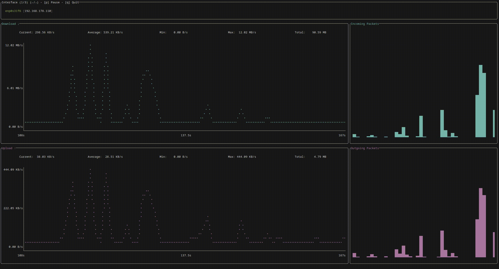

# netviz

[](https://github.com/IchBinLeoon/netviz/releases)
[](https://crates.io/crates/netviz)
[](https://github.com/IchBinLeoon/netviz/actions/workflows/lint.yml)
[](https://github.com/IchBinLeoon/netviz/actions/workflows/publish.yml)
[](https://github.com/IchBinLeoon/netviz/blob/main/LICENSE)

A simple network traffic monitor and visualizer.



## Installation
### Cargo
```
cargo install netviz
```

### Build it from source
```
git clone https://github.com/IchBinLeoon/netviz
cd netviz
cargo build --release
./target/release/netviz
```

## Usage
- Use `←` or `→` to switch between interfaces
- Press `p` to pause
- Press `q` to quit

```
netviz
```

## Contribute
Contributions are welcome! Feel free to open issues or submit pull requests!

## License
This project is licensed under the MIT License. See the [LICENSE](https://github.com/IchBinLeoon/netviz/blob/main/LICENSE) file for more details.
